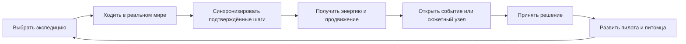
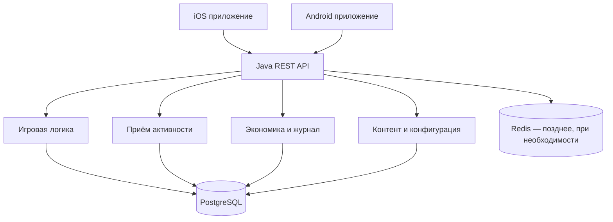

# Walking RPG — первоначальная концепция и паспорт проекта

> **Статус:** стартовая версия концепции `0.1`  
> **Дата фиксации:** 25 июля 2026 года  
> **Рабочее название:** `Walking RPG`  
> **Команда:** два участника — Java-разработчик/владелец продукта и ИИ-партнёр по проектированию, разработке и ревью  
> **Назначение документа:** единая стартовая позиция для дальнейшего планирования, проверки гипотез и развития продукта.

## 1. Статус документа

Этот документ **не является окончательным техническим заданием** и не замораживает продукт навсегда. Он фиксирует исходную гипотезу, границы первой версии и принятые на старте технические решения.

Проект развивается итеративно. Любое решение может быть пересмотрено после:

- пользовательских интервью;
- технических экспериментов;
- проверки работы Apple Health и Health Connect на реальных устройствах;
- анализа удержания и поведения первых тестировщиков;
- появления новых ограничений магазинов приложений;
- изменения доступного времени, бюджета или компетенций команды.

При изменении принципиального решения создаётся ADR в `docs/adr/`, а этот документ получает новую версию.

---

## 2. Краткая формулировка продукта

**Walking RPG** — мобильная асинхронная RPG для iOS и Android, в которой реальная ходьба продвигает виртуальную экспедицию, а пользователь развивает пилота и питомца.

Пользователь выбирает цель и маршрут, убирает телефон, ходит в течение дня, а затем возвращается в приложение, чтобы получить результат прогулки, принять сюжетное решение, распределить награды и развить персонажей.

Ключевой принцип продукта:

> **Walk now, play later — сначала идти, потом играть.**

Приложение не должно требовать постоянного внимания во время движения и не должно превращать прогулку в непрерывное нажатие кнопок.

---

## 3. Проблема, которую решает продукт

Обычные шагомеры хорошо показывают статистику, но слабо объясняют, **зачем пользователю пройти ещё 1 000 шагов сегодня**. Игровые шагомеры нередко сводятся к нескольким фиксированным порогам награды, быстро становятся однообразными либо перегружаются валютами, сундуками и агрессивной монетизацией.

Мы хотим соединить:

- понятную пользу ежедневной ходьбы;
- эмоциональную привязанность к питомцу;
- развитие героя;
- исследование мира;
- короткие осмысленные решения;
- мягкую социальную мотивацию;
- уважение к времени и физическим возможностям пользователя.

---

## 4. Миссия

Помогать людям двигаться больше без давления, чувства вины и ощущения обязательной тренировки — через приключение, к которому хочется возвращаться.

---

## 5. Видение

Мы создаём не «шагомер со скином игры», а **асинхронную экспедиционную RPG**, где физическая активность является источником игрового продвижения, но удовольствие появляется из истории, выбора маршрута, развития пилота и эволюции питомца.

В долгосрочной перспективе продукт должен стать персональным приключением, которое сопровождает пользователя месяцами и годами, адаптируется к его реальному уровню активности и остаётся интересным без необходимости постоянно смотреть в экран.

---

## 6. Целевая аудитория первой версии

Основной сегмент:

- взрослые пользователи примерно 25–44 лет;
- сидячая или удалённая работа;
- низкая или средняя ежедневная активность;
- интерес к casual-RPG, коллекционированию, питомцам и сюжетным играм;
- желание двигаться больше, но неприятие спортивного давления;
- готовность открывать приложение несколько раз в день короткими сессиями.

Первая версия **не пытается одновременно** быть:

- медицинским приложением;
- профессиональным спортивным трекером;
- детской игрой;
- хардкорной RPG;
- геолокационной MMO;
- финансовым или криптовалютным продуктом.

---

## 7. Основной игровой цикл

1. Пользователь выбирает пилота, активного питомца и экспедицию.
2. Выбирает ближайшую цель или маршрут.
3. Ходит в реальном мире с закрытым приложением.
4. Приложение получает подтверждённые шаги из системного источника здоровья.
5. Сервер переводит допустимую активность в энергию экспедиции.
6. Отряд продвигается по виртуальной карте.
7. На узле возникает событие: находка, развилка, бой, спасение, загадка или испытание питомца.
8. Пользователь принимает короткое решение.
9. Пилот и питомец получают опыт, материалы и новые возможности.
10. Пользователь выбирает следующее направление развития и новую экспедицию.



---

## 8. Главные продуктовые принципы

### 8.1. Walk now, play later

Во время прогулки приложение не требует регулярных касаний экрана. Основные решения принимаются до или после активности.

### 8.2. Персональная цель вместо универсальных 10 000 шагов

Цель формируется от реальной активности пользователя и повышается постепенно. Один и тот же фиксированный порог не должен одинаково применяться к человеку с 2 000 и 18 000 шагов в день.

Стартовая гипотеза:

```text
baseline = медиана валидных шагов за последние 7 дней
nextGoal = округление_до_250(baseline × 1.05)
dailyGoal = ограничить(nextGoal, minimumGoal, maximumGoal)
```

Параметры будут уточняться экспериментами. На старте предполагаются награды за достижение 25%, 50%, 75%, 100% и 120% личной цели.

Текущая техническая реализация `adaptive-median-v1` использует предыдущие семь локальных дней, минимум три положительных accepted total, стартовую цель 6 000, диапазон 2 000–12 000 и округление до 250 по правилу half-up. Это реализация гипотезы, а не окончательно доказанный баланс.

Home дополнительно называет число шагов, оставшихся до принятой личной цели,
либо спокойное reached-состояние при равенстве или превышении цели. Feedback
выводится только из server-owned `dailySteps` и `dailyGoal`, не читает Health
history или client clock и не обещает ENERGY либо награду.

### 8.3. Прогресс без наказания

- пропуск дня не разрушает месяцы прогресса;
- питомец не умирает и не страдает из-за отсутствия активности;
- серия может считаться по модели «несколько активных дней из семи»;
- дни отдыха являются нормальной частью системы;
- пользователь с ограниченной подвижностью не должен чувствовать себя проигравшим.

Техническая реализация v1 показывает server-authoritative rolling-ритм из
четырёх активных дней за семь локальных дат. День считается активным только
после accepted activity sync; показатель не выдаёт наград и не хранит streak,
поэтому отдых не выполняет отдельный reset. Полная server-authoritative лента
семи дат различает active/rest без дневных step totals: день отдыха получает
нейтральный marker, а не отрицательный статус. Пока мягкая цель не достигнута,
Home называет только число оставшихся активных дней; формулировка сохраняет
нормальность отдыха и не превращается в streak, дедлайн или обещание награды.
Последняя дата accepted trail явно названа сегодняшней и сохраняет нейтральный
rest-status, если activity ещё не была принята; client clock для этого не
используется. Первая и последняя server-owned даты trail дополнительно
показываются как локализованные границы учитываемого окна, поэтому игроку не
нужно восстанавливать их по weekday markers.

### 8.4. Сервер является источником истины для экономики

Клиент сообщает активность и намерения пользователя. Валюту, опыт, предметы и итог событий рассчитывает сервер.

### 8.5. Сначала простота, затем глубина

Первая версия содержит один ясный цикл. Маркетплейс, десятки валют, сложный крафт, разведение питомцев и PvP не добавляются до подтверждения удержания.

### 8.6. Честная монетизация

Платёж не заменяет ходьбу, не создаёт фиктивные шаги и не даёт прямого преимущества в соревнованиях.

### 8.7. Приватность по умолчанию

В MVP запрашивается только минимально необходимая информация об активности. GPS, пульс, сон, вес и медицинские данные не собираются без отдельного обоснования и решения.

---

## 9. Отличия от базовой механики Diaverse

Новый продукт использует знакомую основу «ходьба → игровой прогресс», но развивает её в самостоятельную систему:

1. **Маршрут и экспедиция**, а не только дневной порог шагов.
2. **Персональная цель**, а не одинаковая планка для всех.
3. **Две разные линии развития:** пилот и питомец.
4. **Развилки и последствия**, создающие разные прохождения при одинаковом числе шагов.
5. **Walk now, play later**, чтобы игра не отвлекала во время движения.
6. **Малые социальные группы**, где вклад оценивается относительно личной цели.
7. **Прозрачная экономика** без криптовалюты и вывода денег.
8. **Серверная проверка активности и антифрод** с самого начала архитектуры.

Мы не копируем название, визуальный стиль, персонажей, тексты, интерфейс или уникальные объекты другой игры. Diaverse используется только как референс жанра и исходная точка анализа.

---

## 10. Пилот

Пилот отражает стратегический стиль пользователя и развивается за завершённые экспедиции, сюжетные решения и устойчивость привычки.

Предварительные направления:

- **Разведчик** — заранее видит больше информации о маршруте;
- **Инженер** — эффективнее использует материалы и ремонтирует экипировку;
- **Командир** — усиливает питомца и командные эффекты;
- **Навигатор** — получает преимущества в длинных экспедициях.

Для MVP достаточно одного пилота, 15–20 уровней и трёх небольших веток навыков. Несколько отдельных пилотов — поздняя механика.

---

## 11. Питомец

Питомец является главным эмоциональным якорем продукта.

Базовые характеристики:

- вид;
- уровень;
- опыт;
- привязанность;
- стадия эволюции;
- пассивная особенность;
- активная способность;
- косметическое состояние.

В MVP планируются три вида питомцев, три стадии эволюции и несколько осмысленных направлений развития:

- разведка;
- защита;
- поиск ресурсов;
- усиление наград за события;
- поддержка небольшого отряда.

Эволюция должна включать выбор, а не быть только автоматическим увеличением чисел.

---

## 12. Мир и экспедиции

Первая глава строится как карта из 15–20 узлов с развилками.

Типы узлов:

- сюжет;
- короткое автоматическое столкновение;
- исследование;
- ресурсная находка;
- выбор с последствиями;
- испытание питомца;
- безопасный лагерь;
- финал главы.

Пользователь видит, **куда привели шаги**, а не только сколько энергии начислено.

---

## 13. Социальная механика

Глобальный рейтинг по абсолютным шагам не является основой продукта: он даёт преимущество людям с профессией или образом жизни, предполагающими очень большую активность.

Предпочтительная модель:

- отряды по 3–5 человек;
- общий недельный маршрут;
- вклад как процент личной цели с верхним пределом;
- напарник поддержки;
- добровольные соревновательные дивизионы;
- готовые реакции вместо открытого чата в MVP.

Социальный блок добавляется после устойчивого одиночного цикла.

---

## 14. Экономика

### 14.1. Базовые сущности

- одна мягкая валюта;
- одна премиальная валюта;
- материалы развития;
- энергия экспедиции;
- опыт пилота;
- опыт питомца.

### 14.2. Стартовая гипотеза перевода шагов

```text
0–100% персональной цели:
    1 энергия за 100 принятых шагов

100–120%:
    1 энергия за 200 шагов

выше 120%:
    шаги сохраняются в статистике,
    но не создают линейно растущую экономическую награду
```

Формула является настраиваемой гипотезой, а не окончательным балансом.

### 14.3. Правила

- один и тот же пакет шагов не может быть награждён дважды;
- любое изменение баланса фиксируется в неизменяемом журнале операций;
- опыт и валюта выдаются не только за шаги, но и за завершение игровых узлов;
- оплата не увеличивает подтверждённое число шагов;
- сезон не обнуляет основной прогресс пилота и питомца.

---

## 15. Монетизация

Допустимые направления после подтверждения удержания:

- косметические образы пилота и питомца;
- сезонный пропуск;
- темы интерфейса и базы;
- дополнительные сюжетные косметические ветки;
- неслучайные наборы с заранее указанным содержимым;
- необязательная подписка на расширенную статистику и удобства.

Не планируется в MVP:

- pay-to-win;
- продажа шаговой энергии;
- платные случайные сундуки;
- криптовалюта;
- NFT;
- вывод денег;
- аренда и перепродажа персонажей;
- платное преимущество в рейтинге.

---

## 16. Состав MVP

### 16.1. Входит

| Область | Состав первой версии |
|---|---|
| Активность | Чтение шагов, дневная история, персональная цель, офлайн-синхронизация |
| Пилот | Один пилот, 15–20 уровней, три ветки навыков |
| Питомцы | Три вида, уровни, привязанность, три стадии эволюции |
| Мир | Одна глава, 15–20 узлов, несколько визуальных биомов |
| Игровой цикл | Экспедиции, продвижение, события, короткие автоматические столкновения |
| Контент | 20–30 заданий, ежедневные и недельные цели, достижения |
| Экономика | Энергия, мягкая валюта, материалы, серверный журнал операций |
| Техническое | Аналитика, crash reporting, push, remote config, базовый антифрод |
| Монетизация | Косметика и сезонный пропуск — только после проверки основного цикла |

### 16.2. Не входит

- GPS-карта и открытый геолокационный мир;
- real-time PvP;
- глобальный чат;
- криптовалюты и вывод денег;
- торговая площадка;
- аренда питомцев;
- сложная генетика и размножение;
- отдельные приложения для часов;
- полноценный 3D-мир;
- десятки пилотов;
- микросервисная архитектура;
- сложный крафт из большого количества ресурсов.

---

## 17. Техническое видение

### 17.1. Общая архитектура

Для команды из двух участников выбирается **монорепозиторий и модульный монолит**.



На первом этапе backend остаётся одним развёртываемым приложением. Внутри он делится на изолированные функциональные модули. Выделение микросервисов допускается только после появления подтверждённой нагрузки или независимых циклов релиза.

### 17.2. Мобильное приложение

- Flutter — единая основная кодовая база;
- Swift — точечный нативный мост Apple Health;
- Kotlin — точечный нативный мост Health Connect, если готового безопасного решения будет недостаточно;
- локальное хранение для офлайн-сценариев;
- REST/JSON для первой интеграции;
- основной UI — 2D/2.5D;
- анимации позднее могут быть реализованы через Rive или Spine после визуального прототипа.

### 17.3. Backend

- **Java 21**;
- **Spring Boot 4.1.x**;
- Spring MVC;
- Bean Validation;
- PostgreSQL;
- Flyway после появления первой постоянной модели;
- Redis только после появления измеренной потребности;
- Docker Compose для локальной инфраструктуры;
- Maven Wrapper;
- модульный монолит с пакетами по бизнес-возможностям, а не одной общей папкой `service`.

Решение использовать Java вместо Kotlin принято осознанно: основной разработчик специализируется на Java, а скорость и надёжность разработки для команды из двух человек важнее потенциальной лаконичности другого JVM-языка.

### 17.4. Серверная авторитетность

Сервер рассчитывает:

- допустимую дельту шагов;
- энергию;
- опыт;
- награды;
- состояние экспедиции;
- итог события;
- баланс кошелька;
- место в рейтинге.

Клиент не имеет права самостоятельно назначать эти значения.

---

## 18. Первоначальный контракт синхронизации активности

Контракт пока является черновым и будет проверяться техническим прототипом.

```json
{
  "localDate": "2026-07-25",
  "timeZone": "Europe/Moscow",
  "authoritativeTotal": 6842,
  "buckets": [
    {
      "from": "2026-07-25T08:00:00+03:00",
      "to": "2026-07-25T09:00:00+03:00",
      "steps": 412
    }
  ],
  "syncCursor": "opaque-cursor",
  "idempotencyKey": "device-date-sequence",
  "attestation": "signed-token"
}
```

Backend должен:

1. найти последнюю принятую сумму за локальный день;
2. определить положительную дельту;
3. проверить идемпотентность;
4. оценить сигналы риска;
5. записать событие активности;
6. начислить допустимую энергию;
7. вернуть новую версию игрового состояния.

---

## 19. Антифрод

Минимальная архитектурная закладка:

- идемпотентность всех запросов начисления;
- append-only журнал экономики;
- дневные мягкие и жёсткие лимиты;
- анализ резких скачков;
- хранение источника данных;
- отдельный risk score;
- аттестация приложения и устройства позднее;
- временное исключение подозрительного результата из рейтинга вместо автоматического необратимого бана.

Антифрод не должен превращаться в отдельный большой продукт до появления реальной эксплуатации, но модель данных не должна делать его невозможным.

---

## 20. Конфиденциальность и безопасность

В MVP запрашиваются только шаги.

Не запрашиваются без нового обоснованного решения:

- геолокация;
- пульс;
- сон;
- вес;
- контакты;
- фотографии;
- медицинские записи.

Обязательные свойства продукта:

- удаление аккаунта;
- отзыв разрешения;
- экспорт пользовательских данных;
- понятная политика хранения;
- шифрование трафика;
- отсутствие передачи данных активности рекламным системам;
- минимизация персональных данных;
- логирование административных операций.

---

## 21. Структура репозитория

```text
walking-rpg/
├── PROJECT_VISION.md       # этот документ — исходная концепция
├── README.md               # запуск и навигация по репозиторию
├── CONTRIBUTING.md         # рабочий процесс команды из двух участников
├── compose.yaml            # локальная инфраструктура
├── backend/                # Java + Spring Boot
├── mobile/                 # Flutter
├── docs/                   # архитектура, roadmap, backlog и ADR
└── scripts/                # вспомогательные команды
```

---

## 22. Модель совместной разработки вдвоём

### 22.1. Роль владельца продукта и Java-разработчика

- финальные продуктовые решения;
- приоритизация;
- Java/backend-разработка;
- локальный запуск и проверка на реальных устройствах;
- управление аккаунтами Apple/Google и облачной инфраструктурой;
- приёмка результата;
- хранение исходного репозитория.

### 22.2. Роль ИИ-партнёра

В рамках каждой рабочей сессии:

- декомпозиция задач;
- проектирование архитектуры и контрактов;
- подготовка Java, Dart, SQL, конфигураций и тестов;
- аудит кода и поиск переусложнений;
- подготовка миграций и документации;
- анализ ошибок сборки и поведения;
- формирование готовых файлов, патчей и архивов;
- поддержка продуктовых исследований и балансировки.

ИИ не выполняет автономную фоновую работу между сессиями. Для продолжения разработки используется актуальная версия репозитория или конкретные изменённые файлы.

### 22.3. Рабочий цикл

1. Выбираем одну пользовательскую ценность.
2. Формулируем критерии приёмки.
3. Проектируем минимальный вертикальный срез.
4. Реализуем backend и mobile вместе с тестами.
5. Проверяем на реальном устройстве.
6. Фиксируем решение и результат.
7. Только после этого расширяем функциональность.

---

## 23. Принципы разработки

- маленькие завершённые вертикальные срезы;
- одна задача — одна понятная цель;
- API-first для интеграции mobile/backend;
- серверная идемпотентность;
- миграции вместо ручного изменения БД;
- конфигурация баланса вне мобильного релиза;
- отсутствие преждевременных микросервисов;
- тесты для формул наград и критической экономики;
- observability до публичного запуска;
- безопасность и приватность входят в Definition of Done;
- никакой сложной механики без метрики, которую она должна улучшить.

---

## 24. Дорожная карта

### Этап 0. Основание проекта

- зафиксировать концепцию;
- создать репозиторий;
- поднять Java backend;
- поднять Flutter shell;
- определить рабочий процесс;
- оформить первые ADR.

### Этап 1. Технический spike шагов

- Apple Health на реальном iPhone;
- Health Connect на нескольких Android-устройствах;
- повторная синхронизация без двойного начисления;
- offline → online;
- часовые пояса;
- изменение и удаление данных источником.

### Этап 2. Вертикальный срез

- onboarding;
- разрешение на шаги;
- один пилот;
- один питомец;
- одна экспедиция;
- один узел;
- одна награда;
- server-side ledger;
- минимальная аналитика.

### Этап 3. MVP

- первая глава;
- три питомца;
- базовая эволюция;
- навыки пилота;
- задания;
- достижения;
- инвентарь;
- адаптивная цель;
- push;
- админская конфигурация контента.

### Этап 4. Закрытая бета

- 50–500 пользователей;
- проверка удержания;
- проверка изменения активности;
- баланс экономики;
- антифрод;
- батарея и стабильность;
- корректировка onboarding.

### Этап 5. Soft launch

- первый сезон;
- небольшой социальный блок;
- отряды;
- недельные маршруты;
- A/B-тесты;
- осторожная монетизация.

Подробная декомпозиция находится в `docs/ROADMAP.md`.

---

## 25. Критерии успеха

### 25.1. Продуктовые

- пользователь понимает цикл без объяснения разработчика;
- первая подтверждённая награда получается в первые сутки;
- прогулка ощущается частью приключения;
- питомец вызывает желание вернуться;
- прогресс не воспринимается как наказание;
- пользователь видит, куда привели его шаги.

### 25.2. Технические

- повторная синхронизация не создаёт повторную награду;
- приложение работает с закрытым экраном;
- потеря сети не уничтожает активность;
- сервер может восстановить историю начисления;
- критическая экономика покрыта автоматическими тестами;
- мобильное приложение не требует GPS в MVP.

### 25.3. Начальные метрики-гипотезы

Метрики не являются обещанием; они задают ориентиры для беты:

- более 70% завершивших onboarding дают разрешение на шаги;
- более 55% получают первую награду в первые сутки;
- D7 выше 25%;
- D30 выше 10%;
- crash-free sessions выше 99,5%;
- ошибка синхронизации ниже 1%;
- у низко- и среднеактивной группы появляется измеримый рост ходьбы;
- доля подозрительных начислений остаётся управляемой.

Главная метрика первой версии:

> **Meaningful Active Week:** пользователь достиг личной цели минимум в три дня, завершил хотя бы один экспедиционный узел и совершил хотя бы одно действие развития пилота или питомца.

---

## 26. Основные риски

| Риск | Стартовая защита |
|---|---|
| Двойной учёт телефона и часов | Системная агрегация, серверная дельта, идемпотентность |
| Накрутка шагов | Лимиты, источник данных, risk score, аттестация позднее |
| Слишком сложная экономика | Минимум валют, remote config, ledger |
| Быстро заканчивается контент | Узлы-шаблоны, развилки, конфигурация контента |
| Фиксированная цель демотивирует | Персональный baseline и дни отдыха |
| Игра отвлекает на улице | Walk now, play later |
| Нечестный рейтинг | Процент личной цели и дивизионы |
| Scope creep | Жёсткий список того, что не входит в MVP |
| Команда из двух человек перегружена | Вертикальные срезы, монолит, отсутствие лишней инфраструктуры |
| Зависимость от health API | Ранний технический spike на реальных устройствах |
| Непредсказуемый review магазинов | Минимальные разрешения, прозрачные тексты и privacy-by-design |

---

## 27. Открытые вопросы

До начала полноценного производства необходимо последовательно решить:

1. Финальное рабочее название и визуальная тема мира.
2. Главная эмоция: исследование, спасение мира, забота о питомце или коллекционирование.
3. Боевой формат: полностью автоматический либо выбор одной способности перед событием.
4. Допустимый диапазон персональной цели.
5. Правила дней отдыха.
6. Как долго может накапливаться энергия.
7. Нужна ли мягкая валюта в первом вертикальном срезе.
8. Какую часть контента конфигурировать без релиза приложения.
9. Гостевой режим и момент обязательной регистрации.
10. Минимальная поддерживаемая версия iOS и Android.
11. Нужен ли готовый health-плагин Flutter или сразу собственные platform channels.
12. Где будет размещён первый backend.
13. Какой уровень антифрода обязателен до закрытой беты.
14. Нужна ли английская локализация в первом тесте.

---

## 28. Зафиксированные стартовые решения

На версии документа `0.1` считаются принятыми:

- продукт — walking-RPG для iOS и Android;
- основной цикл — ходьба → экспедиция → событие → развитие;
- пилот и питомец развиваются отдельно;
- принцип walk now, play later;
- персональная цель вместо единого порога;
- Flutter для mobile;
- Java для backend;
- Spring Boot и модульный монолит;
- монорепозиторий;
- PostgreSQL как основная будущая БД;
- отсутствие GPS в MVP;
- отсутствие криптовалюты и cash-out;
- отсутствие pay-to-win;
- сервер является источником истины экономики;
- проект создаётся и развивается командой из двух участников;
- решения эволюционируют на основе проверок, а не защищаются из принципа.

---

## 29. Ближайший практический результат

Следующая цель проекта — не полный MVP, а **технически честный вертикальный срез**:

> пользователь открывает приложение, видит пилота и питомца, получает реальные шаги из системного источника, отправляет их на Java backend, не получает повторную награду при повторной синхронизации и продвигает одну экспедицию до одного игрового события.

До достижения этого результата не расширяем проект кланами, рынком, PvP, сложным крафтом или большим количеством контента.

---

## 30. История изменений

| Версия | Дата | Изменение |
|---|---|---|
| 0.1 | 2026-07-25 | Зафиксирована первоначальная концепция; backend изменён с Kotlin на Java; учтена разработка командой из двух участников |
