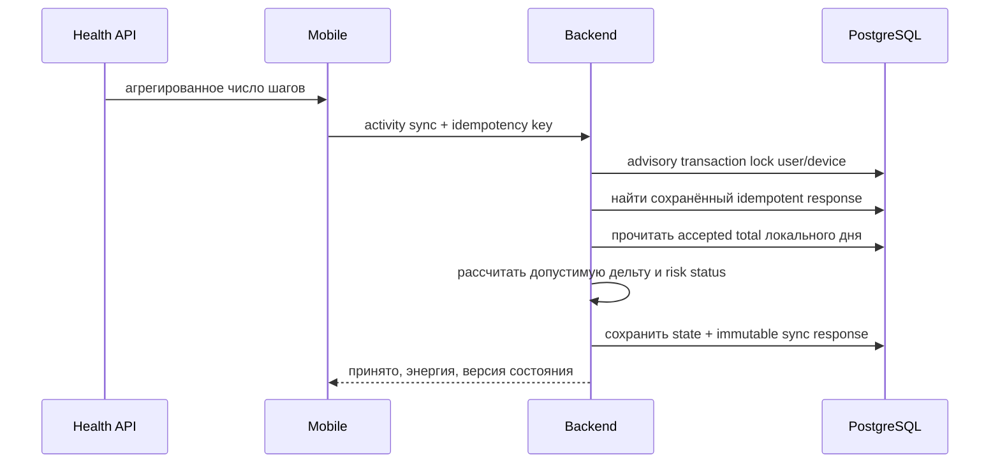

# Первоначальная архитектура

## 1. Контекст

Проект разрабатывается командой из двух участников. Главный архитектурный приоритет — быстро получать проверяемые вертикальные срезы без создания инфраструктуры, которую пока некому обслуживать.

## 2. Решение

- монорепозиторий;
- Flutter mobile;
- Java/Spring Boot backend;
- модульный монолит;
- REST/JSON;
- PostgreSQL;
- Flyway;
- серверная экономика;
- офлайн-способный mobile;
- конфигурация баланса с возможностью вынесения в remote config;
- Redis, очередь и отдельные сервисы только по фактической необходимости.

## 3. Модули backend

Планируемые функциональные области:

```text
identity       — профиль, устройства, согласия
activity       — приём и нормализация активности
progression    — пилот, питомец, уровни и навыки
expedition     — карта, узлы, события и прохождение
economy        — кошелёк, ledger, награды и покупки
content        — главы, задания, конфигурация
social         — отряды и недельные цели, позднее
risk           — антифрод-сигналы, позднее
shared         — только действительно общие примитивы
```

Пакеты группируются по функциональности. Не создаётся единый глобальный слой `controller/service/repository` на весь проект.

## 4. Поток активности



Операция `POST /api/v1/activity/sync` выполняется в одной транзакции. PostgreSQL advisory transaction lock сериализует запросы по паре `userId + deviceId`, поэтому два backend-инстанса не могут одновременно рассчитать состояние одного устройства на устаревшем total.

## 5. Инварианты

1. Один `idempotencyKey` не создаёт две награды.
2. Один ключ с другим payload возвращает конфликт.
3. Баланс изменяется только через ledger-запись — ledger появится в first playable.
4. Клиент не задаёт итоговую награду.
5. Дата активности хранится вместе с часовым поясом в команде, а состояние индексируется по локальному дню.
6. Понижение системного total не приводит к автоматическому отрицательному балансу.
7. Любое серверное состояние имеет версию для защиты от повторной записи старых данных.
8. Формулы баланса тестируются отдельно от web-слоя.
9. Повторный sync возвращает ранее сохранённый response, включая исходный `serverTime`.

## 6. Текущая схема данных

Первая Flyway-миграция создаёт только сущности, необходимые работающему activity-sync срезу:

```text
app_user
app_device
activity_sync_state
processed_activity_sync
```

`app_user` и `app_device` пока являются технической identity, полученной из временных HTTP-заголовков. `activity_sync_state` содержит монотонный accepted total и версию по паре user/device/localDate. `processed_activity_sync` хранит SHA-256 fingerprint команды и полный response, необходимый для идемпотентного повтора.

Ориентировочный дальнейший набор:

```text
consent
activity_ingestion_detail
economy_ledger
pilot_instance
pet_instance
expedition
expedition_node_progress
reward_claim
content_version
```

Не создаём все таблицы заранее. Каждая миграция появляется вместе с работающей пользовательской функцией.

## 7. Конкурентность и транзакции

- web-запрос открывает Spring transaction;
- backend получает transaction-scoped advisory lock по user/device;
- затем проверяет idempotency;
- читает и изменяет дневное состояние;
- сохраняет response того же запроса;
- commit одновременно публикует state и idempotent response;
- rollback не оставляет частично обработанный ключ.

Такой подход подходит для нескольких экземпляров модульного монолита без Redis-lock. Более сложная распределённая координация не вводится до появления измеренной необходимости.

## 8. Наблюдаемость

До закрытой беты должны быть:

- структурированные логи;
- trace/correlation ID;
- метрики времени ответа;
- метрики ошибок синхронизации;
- метрики повторных запросов;
- crash reporting mobile;
- журнал экономических операций.

## 9. Границы текущей реализации

Backend содержит runnable shell, activity-sync HTTP-контракт, доменный расчёт и PostgreSQL persistence. Flyway и Testcontainers проверяют схему на чистой БД; accepted state и idempotent response переживают создание нового экземпляра сервиса.

Пока не реализованы проверка attestation, постоянная аутентификация, подробное ingestion-хранилище, retention, economy ledger и продвижение экспедиции. Текущая энергия в response является результатом расчёта, но ещё не зачисляется в кошелёк игрока.
