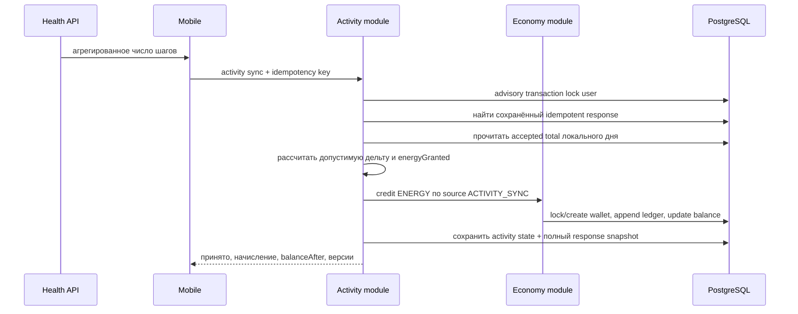
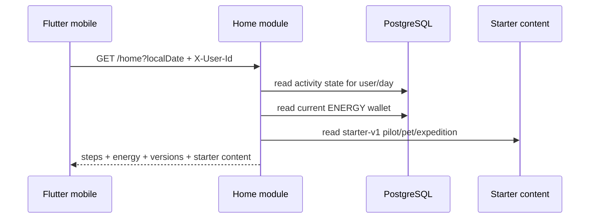

# Первоначальная архитектура

## 1. Контекст

Проект разрабатывается командой из двух участников. Главный архитектурный приоритет — быстро получать проверяемые вертикальные срезы без создания инфраструктуры, которую пока некому обслуживать.

## 2. Решение

- монорепозиторий;
- Flutter mobile;
- Java/Spring Boot backend;
- модульный монолит;
- REST/JSON;
- PostgreSQL;
- Flyway;
- серверная экономика;
- офлайн-способный mobile;
- конфигурация баланса с возможностью вынесения в remote config;
- Redis, очередь и отдельные сервисы только по фактической необходимости.

## 3. Модули backend

Функциональные области:

```text
identity       — профиль, устройства, согласия
activity       — приём и нормализация активности
home           — агрегированный read-model главного экрана
progression    — пилот, питомец, уровни и навыки
expedition     — карта, узлы, события и прохождение
economy        — кошелёк, ledger, награды и покупки
content        — главы, задания, конфигурация
social         — отряды и недельные цели, позднее
risk           — антифрод-сигналы, позднее
shared         — только действительно общие примитивы
```

Пакеты группируются по функциональности. Не создаётся единый глобальный слой `controller/service/repository` на весь проект.

## 4. Поток активности и энергии



Операция `POST /api/v1/activity/sync` выполняется в одной транзакции. PostgreSQL advisory transaction lock сериализует activity-запросы пользователя, в том числе с разных устройств. Economy module дополнительно блокирует строку кошелька `FOR UPDATE`, чтобы будущие источники начислений и списаний не могли изменить один баланс одновременно.

## 5. Production home read-model



Home query является read-only и не вызывает activity/economy command services. Один SQL projection возвращает нули при отсутствии строк. Это позволяет открыть приложение до первой синхронизации, но не создаёт аккаунт по произвольному временно переданному логину.

`localDate` приходит с mobile, потому что backend не должен вычислять календарный день пользователя по UTC. IANA time zone возвращается из уже сохранённого activity state. Если синхронизации за день не было, `timeZone` и `lastActivitySyncAt` равны `null`.

Starter pilot, pet и expedition версионируются через `contentVersion=starter-v1`, но пока не являются индивидуальным mutable state.

## 6. Инварианты

1. Один `idempotencyKey` не создаёт две награды.
2. Один ключ с другим payload возвращает конфликт.
3. Баланс изменяется только через `economy_ledger`; `economy_wallet` является транзакционной проекцией текущего баланса.
4. Клиент не задаёт итоговую награду.
5. Дата активности хранится вместе с часовым поясом в команде, а состояние индексируется по пользователю и локальному дню.
6. Несколько устройств не создают отдельные reward high-watermark; cumulative total между устройствами не суммируется.
7. Понижение системного total не приводит к автоматическому отрицательному балансу.
8. Любое серверное состояние имеет версию для защиты от повторной записи старых данных.
9. Формулы баланса тестируются отдельно от web-слоя.
10. Повторный sync возвращает ранее сохранённый response, включая исходные activity/economy версии и `serverTime`.
11. Activity state, wallet credit, ledger entry и processed response публикуются одним commit транзакции либо не публикуются вообще.
12. Один economy source не может создать две ledger-записи: действует уникальность `user + currency + sourceType + sourceKey`.
13. Query endpoint не создаёт состояние как побочный эффект.
14. `GET /home` возвращает текущий wallet, а не `energyBalanceAfter` случайно выбранного command response.
15. Отсутствующее состояние возвращается явно как zero-state, а не скрытая фиктивная запись.

## 7. Текущая схема данных

Flyway-миграции создают сущности работающего activity/economy среза:

```text
app_user
app_device
activity_sync_state
processed_activity_sync
economy_wallet
economy_ledger
```

`app_user` и `app_device` пока являются технической identity, полученной из временных HTTP-заголовков. `activity_sync_state` содержит общий монотонный accepted total и версию по паре user/localDate. `processed_activity_sync` хранит SHA-256 fingerprint бизнес-команды и полный response snapshot, необходимый для идемпотентного повтора.

`economy_wallet` хранит текущий баланс и его версию по паре user/currency. `economy_ledger` является append-only журналом операций; первая валюта — `ENERGY`, первая причина — `ACTIVITY_STEPS`, первый source type — `ACTIVITY_SYNC`.

Home read-model не имеет отдельной таблицы. Он проецируется из activity/economy данных и starter content.

Ориентировочный дальнейший набор:

```text
consent
activity_ingestion_detail
pilot_instance
pet_instance
expedition
expedition_node_progress
reward_claim
content_version
```

Не создаём все таблицы заранее. Каждая миграция появляется вместе с работающей пользовательской функцией.

## 8. Конкурентность и транзакции

- web activity-команда открывает Spring transaction;
- activity module получает transaction-scoped advisory lock по user;
- затем проверяет idempotency в scope user/device/key;
- читает общий дневной activity state;
- economy module создаёт/блокирует wallet row;
- при положительном начислении проверяет уникальный ledger source, обновляет wallet и добавляет ledger entry;
- activity module сохраняет state и полный processed response;
- commit одновременно публикует activity и economy состояния;
- rollback не оставляет частично обработанный ключ, баланс или ledger entry;
- home query использует отдельную read-only transaction и не берёт write-lock.

Такой подход подходит для нескольких экземпляров модульного монолита без Redis-lock. Более сложная распределённая координация не вводится до появления измеренной необходимости.

## 9. Command snapshot и query state

`energyBalanceAfter` в activity response — баланс сразу после исходной операции. Повтор старого `idempotencyKey` возвращает тот же snapshot даже в случае, если более новые операции уже увеличили текущий баланс.

`GET /home` возвращает текущий `economy_wallet.balance`. Это разделяет две задачи:

- command response остаётся строго идемпотентным;
- query endpoint возвращает самое новое серверное состояние.

## 10. Mobile data flow

Flutter использует dependency-light `dart:io` transport. Base URL и временный user ID задаются через `--dart-define`. Главный экран имеет явные состояния loading/error/retry и отдельный пользовательский переход к demo snapshot.

Silent fallback запрещён: иначе отсутствие backend можно ошибочно принять за корректный нулевой баланс.

Offline cache и activity upload появятся отдельными вертикальными срезами.

## 11. Наблюдаемость

До закрытой беты должны быть:

- структурированные логи;
- trace/correlation ID;
- метрики времени ответа;
- метрики ошибок синхронизации;
- метрики повторных запросов;
- метрики home read latency/error;
- crash reporting mobile;
- метрики economy credit/debit;
- контроль расхождения wallet projection и ledger sum.

## 12. Границы текущей реализации

Backend содержит runnable shell, activity-sync HTTP-контракт, PostgreSQL persistence, ENERGY ledger и production home read-model. Flutter читает home response и отображает реальные шаги/баланс.

Пока не реализованы проверка attestation, постоянная аутентификация, подробное ingestion-хранилище, retention processed sync, отправка activity из mobile, offline cache, сохраняемые pilot/pet/expedition, трата энергии и продвижение экспедиции.
