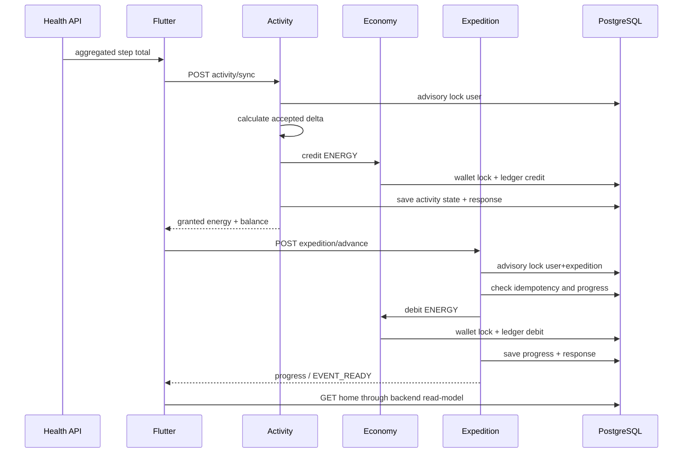

# Первоначальная архитектура

## 1. Контекст

Проект разрабатывается командой из двух участников. Главный приоритет — получать проверяемые вертикальные срезы без инфраструктуры, которую пока некому обслуживать.

## 2. Решение

- монорепозиторий;
- Flutter mobile;
- Java/Spring Boot backend;
- модульный монолит;
- REST/JSON;
- PostgreSQL + Flyway;
- серверная экономика;
- офлайн-способный mobile в последующих итерациях;
- Redis, очередь и отдельные сервисы только по измеренной необходимости.

## 3. Модули backend

```text
identity       — профиль, устройства, согласия
activity       — приём и нормализация активности
economy        — wallet, ledger, credit/debit
expedition     — progress, узлы, события и команды прохождения
home           — агрегированный read-model главного экрана
progression    — пилот, питомец, уровни и навыки, позднее
content        — главы и конфигурация, позднее
social         — отряды и недельные цели, позднее
risk           — антифрод-сигналы, позднее
shared         — только общие примитивы
```

Пакеты группируются по функциональности, а не в один глобальный `controller/service/repository`.

## 4. Сквозной поток



## 5. Инварианты

1. Один activity idempotency key не создаёт две награды.
2. Один expedition idempotency key не создаёт два списания.
3. Один key с другим payload возвращает конфликт.
4. Баланс изменяется только через `economy_ledger`.
5. `economy_wallet` — транзакционная проекция текущего баланса.
6. Wallet не может стать отрицательным.
7. Клиент не задаёт итоговую награду или новый баланс.
8. Несколько устройств используют один activity high-watermark пользователя.
9. Понижение системного total не создаёт отрицательную награду.
10. Activity command response и expedition command response сохраняются как immutable snapshot.
11. Activity state + credit + response публикуются одним transaction commit.
12. Debit + expedition progress + response публикуются одним transaction commit.
13. Один economy source создаёт не более одной ledger-записи.
14. `GET /home` является read-only и не создаёт zero-state в БД.
15. После `EVENT_READY` progress не меняется до отдельной команды resolution.

## 6. Текущая схема данных

```text
app_user
app_device
activity_sync_state
processed_activity_sync
economy_wallet
economy_ledger
expedition_progress
processed_expedition_advance
```

`processed_*` таблицы содержат fingerprint и исходный response snapshot. Это позволяет повторить команду спустя перезапуск без повторного изменения состояния и без подмены ответа более новым балансом.

## 7. Конкурентность

### Activity

- transaction-scoped advisory lock по user;
- общий daily high-watermark;
- wallet row lock внутри economy;
- commit activity state, credit и response.

### Expedition

- transaction-scoped advisory lock по user + expedition;
- проверка idempotency до debit;
- wallet row `FOR UPDATE`;
- проверка достаточности баланса;
- commit debit, ledger, progress и response.

Такой подход работает на нескольких экземплярах модульного монолита без Redis-lock.

## 8. Контент и состояние

`starter-v1` пока является server-owned code content:

```text
expeditionId: starter-expedition-v1
nodeId:       outer-beacon
threshold:    30 ENERGY
eventId:      signal-source-v1
```

Контент и mutable state разделены:

- имена, тексты и пороги находятся в content definition;
- progress/status/version находятся в PostgreSQL;
- command response сохраняет текстовый snapshot для точного replay.

Перед появлением второй главы content definition будет вынесен в версионируемое хранилище или CMS.

## 9. Mobile

Flutter:

- читает production home snapshot;
- показывает loading/error/retry;
- отправляет idempotent expedition advance;
- после успеха перечитывает home state;
- не выполняет optimistic изменение баланса;
- показывает событие только после серверного `EVENT_READY`.

## 10. Наблюдаемость до beta

- структурированные логи;
- trace/correlation ID;
- latency/error metrics;
- activity duplicate metrics;
- economy credit/debit metrics;
- wallet-versus-ledger reconciliation;
- expedition conflict metrics;
- mobile crash reporting.

## 11. Границы

Пока не реализованы authentication, attestation, retention processed commands, Health API bridge, event resolution, event rewards, persistent pilot/pet progression, offline cache и несколько экспедиций.
