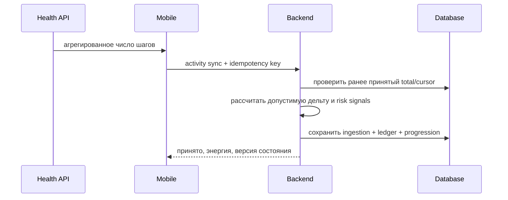

# Первоначальная архитектура

## 1. Контекст

Проект разрабатывается командой из двух участников. Главный архитектурный приоритет — быстро получать проверяемые вертикальные срезы без создания инфраструктуры, которую пока некому обслуживать.

## 2. Решение

- монорепозиторий;
- Flutter mobile;
- Java/Spring Boot backend;
- модульный монолит;
- REST/JSON;
- PostgreSQL;
- серверная экономика;
- офлайн-способный mobile;
- конфигурация баланса с возможностью вынесения в remote config;
- Redis, очередь и отдельные сервисы только по фактической необходимости.

## 3. Модули backend

Планируемые функциональные области:

```text
identity       — профиль, устройства, согласия
activity       — приём и нормализация активности
progression    — пилот, питомец, уровни и навыки
expedition     — карта, узлы, события и прохождение
economy        — кошелёк, ledger, награды и покупки
content        — главы, задания, конфигурация
social         — отряды и недельные цели, позднее
risk           — антифрод-сигналы, позднее
shared         — только действительно общие примитивы
```

Пакеты группируются по функциональности. Не создаётся единый глобальный слой `controller/service/repository` на весь проект.

## 4. Поток активности



## 5. Инварианты

1. Один `idempotencyKey` не создаёт две награды.
2. Баланс изменяется только через ledger-запись.
3. Клиент не задаёт итоговую награду.
4. Дата активности хранится вместе с часовым поясом и UTC-временем.
5. Понижение системного total не приводит к автоматическому отрицательному балансу.
6. Любое серверное состояние имеет версию для защиты от повторной записи старых данных.
7. Формулы баланса тестируются отдельно от web-слоя.

## 6. Первая схема данных

Сущности появятся по мере вертикального среза, ориентировочный набор:

```text
app_user
device
consent
activity_ingestion
activity_daily
sync_state
pilot_instance
pet_instance
expedition
expedition_node_progress
economy_ledger
reward_claim
content_version
```

Не создаём все таблицы заранее. Каждая миграция появляется вместе с работающей пользовательской функцией.

## 7. Наблюдаемость

До закрытой беты должны быть:

- структурированные логи;
- trace/correlation ID;
- метрики времени ответа;
- метрики ошибок синхронизации;
- метрики повторных запросов;
- crash reporting mobile;
- журнал экономических операций.

## 8. Границы текущего scaffold

Текущий backend содержит только runnable shell и демонстрационный endpoint. PostgreSQL включён в `compose.yaml`, но постоянная модель намеренно не добавлена до проектирования первого activity-sync вертикального среза.
