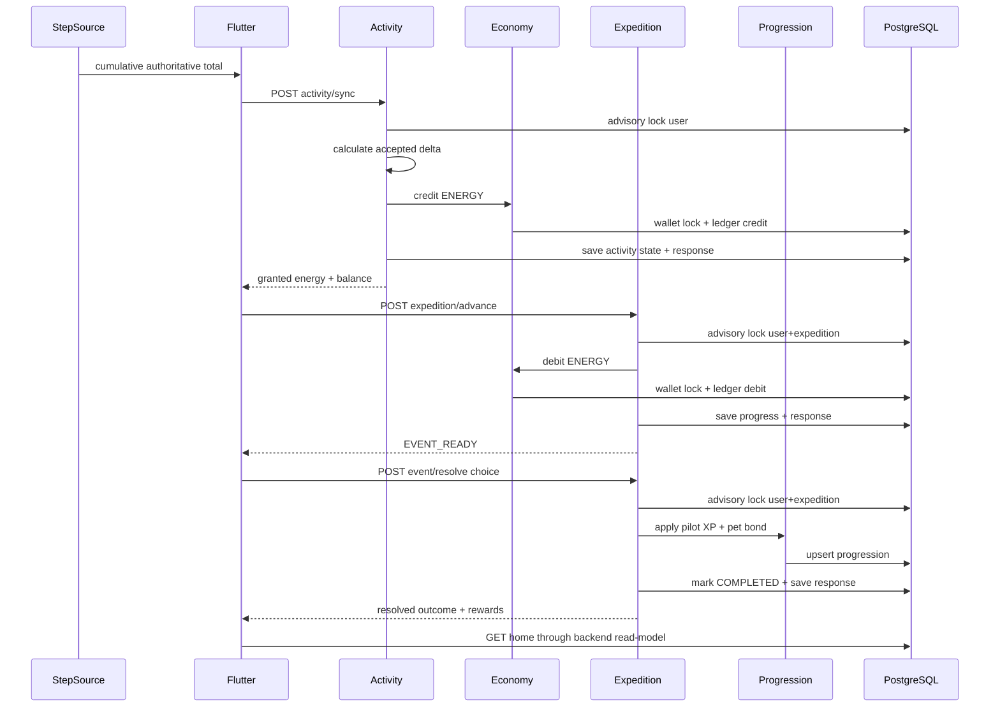

# Архитектура Walking RPG

## 1. Контекст

Проект разрабатывается командой из двух участников. Главный приоритет — проверяемые вертикальные срезы без инфраструктуры, которую пока некому обслуживать.

## 2. Базовые решения

- монорепозиторий;
- Flutter mobile;
- Java 21 / Spring Boot backend;
- модульный монолит;
- REST/JSON;
- PostgreSQL + Flyway;
- server-authoritative economy и progression;
- Redis, очередь и отдельные сервисы только по измеренной необходимости.

## 3. Модули backend

```text
identity       — технические пользователь и устройство
activity       — authoritative total, high-watermark, risk status
economy        — wallet, append-only ledger, credit/debit
expedition     — progress, event choice и completion
progression    — pilot XP/level и pet bond/level
home           — агрегированный read-model главного экрана
content        — server-owned definitions; CMS позднее
social         — отряды и недельные цели; позднее
risk           — расширенный антифрод; позднее
shared         — только общие примитивы
```

Пакеты группируются по функциональности, а не в один глобальный `controller/service/repository`.

## 4. Сквозной поток first playable



## 5. Инварианты

1. Один activity key не создаёт две награды.
2. Один expedition key не создаёт два списания.
3. Один event key не создаёт две progression reward.
4. Один key с другим payload возвращает конфликт.
5. Баланс изменяется только через `economy_ledger`.
6. `economy_wallet` — транзакционная проекция текущего баланса.
7. Wallet не может стать отрицательным.
8. Клиент не задаёт reward, balance, progress или progression.
9. Несколько устройств используют один activity high-watermark пользователя.
10. Понижение системного total не создаёт отрицательную награду.
11. Processed command хранит immutable response snapshot.
12. Activity state + credit + response публикуются одним transaction commit.
13. Debit + expedition progress + response публикуются одним transaction commit.
14. Event completion + pilot/pet progression + response публикуются одним transaction commit.
15. Один economy source создаёт не более одной ledger-записи.
16. `GET /home` read-only и не создаёт zero-state.
17. После `EVENT_READY` advance запрещён до resolution.
18. После `COMPLETED` event нельзя разрешить повторно новым key.

## 6. Схема данных

```text
app_user
app_device
activity_sync_state
processed_activity_sync
economy_wallet
economy_ledger
expedition_progress
processed_expedition_advance
pilot_progress
pet_progress
processed_event_resolution
```

`processed_*` таблицы содержат fingerprint и исходный response snapshot. Это обеспечивает exact replay после перезапуска и не подменяет старый command response новым read-model состоянием.

## 7. Конкурентность

### Activity

- transaction-scoped advisory lock по user;
- общий daily high-watermark;
- wallet row lock внутри economy;
- commit activity state, credit и response.

### Expedition advance

- transaction-scoped advisory lock по user + expedition;
- idempotency до debit;
- wallet row `FOR UPDATE`;
- commit debit, ledger, progress и response.

### Event resolution

- тот же lock по user + expedition;
- проверка `EVENT_READY` и открытого eventId;
- progression upsert внутри транзакции;
- commit `COMPLETED`, rewards и response.

Такой подход работает на нескольких экземплярах модульного монолита без Redis-lock.

## 8. Контент и mutable state

`starter-v1` пока хранится в коде:

```text
expeditionId: starter-expedition-v1
nodeId:       outer-beacon
threshold:    30 ENERGY
eventId:      signal-source-v1
choices:      analyze-signal | trust-spark
pilotId:      navigator-v1
petId:        spark-v1
```

Контент и состояние разделены:

- имена, тексты, пороги и reward definitions находятся в content definition;
- activity/economy/expedition/progression state находится в PostgreSQL;
- processed response сохраняет текстовый snapshot для exact replay.

Перед появлением нескольких глав content definition выносится в версионируемое хранилище или CMS.

## 9. Mobile boundaries

Flutter:

- читает production home snapshot;
- отправляет idempotent activity, advance и resolution commands;
- после успеха перечитывает home;
- не выполняет optimistic изменение server state;
- разделяет `StepSource` и `ActivityApiClient`.

```text
StepSource
  platform-specific чтение cumulative total

ActivityApiClient
  стабильный backend contract

ActivitySyncCoordinator
  повтор одного reading с тем же key после ошибки
```

Development source включается только явным feature flag и не считается health-интеграцией.

## 10. Наблюдаемость до beta

- структурированные логи;
- trace/correlation ID;
- latency/error metrics;
- activity duplicate metrics;
- economy credit/debit metrics;
- wallet-versus-ledger reconciliation;
- expedition/event conflict metrics;
- progression reward metrics;
- mobile crash reporting.

## 11. Границы

Пока не реализованы authentication, attestation, retention processed commands, Apple Health/Health Connect, permissions, background delivery, offline command queue, несколько экспедиций, inventory и CMS.
