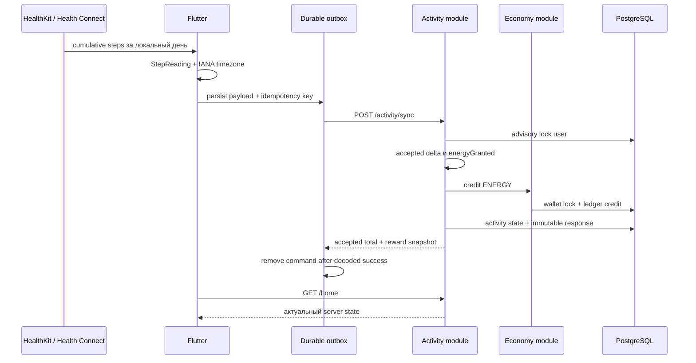
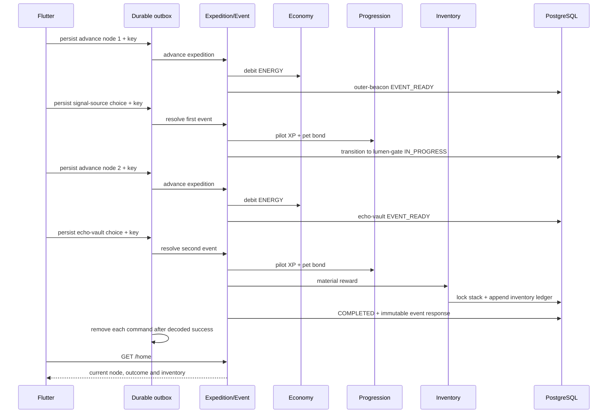

# Архитектура Walking RPG

## 1. Контекст

Проект разрабатывается командой из двух участников. Главный приоритет — получать проверяемые вертикальные срезы без инфраструктуры, которую пока некому обслуживать.

## 2. Базовые решения

- монорепозиторий;
- Flutter mobile;
- Java 21 / Spring Boot backend;
- модульный монолит;
- REST/JSON;
- PostgreSQL + Flyway;
- server-authoritative экономика;
- platform adapters за доменными интерфейсами;
- foreground durable outbox на mobile;
- Redis, broker и отдельные сервисы только по измеренной необходимости.

## 3. Backend-модули

```text
identity       — технические пользователи и устройства
activity       — приём cumulative activity и high-watermark
goal           — личная дневная цель из accepted activity history
economy        — wallet, ledger, credit/debit
expedition     — progress, узлы, события и команды прохождения
progression    — pilot XP, pet bond, уровни
inventory      — material stack и append-only reward ledger
home           — агрегированный read-model главного экрана
content        — server-owned starter content; CMS позднее
social         — отряды и недельные цели; позднее
risk           — антифрод-сигналы; позднее
shared         — только действительно общие примитивы
```

Пакеты группируются по функциональности, а не в один глобальный `controller/service/repository`.

## 4. Mobile-модули

```text
core/config          — compile-time environment
core/commands        — durable command model, store, lanes и replay runtime
activity/domain      — StepSource, StepReading, sync result
activity/data        — HealthKit/Health Connect adapters и REST client
activity/application — platform reading coordinator
activity/presentation — sync/recovery shell
home                 — server-authoritative read-model
expedition           — ENERGY spend REST contract
event                — event resolution REST contract
```

Android- и iOS-host проекты versioned в репозитории.

## 5. Сквозной поток активности



Mobile не отправляет сырые health samples и не вычисляет награду.

## 6. Игровой поток first playable



`signal-source-v1` продолжает ту же экспедицию на второй узел. `echo-vault-v1` завершает её и выдаёт stackable material. Каждый переход и reward находится внутри транзакции соответствующей server-команды.

## 7. Ключевые инварианты

1. Клиент не задаёт accepted delta, награду или новый баланс.
2. Один activity idempotency key не создаёт две награды.
3. Один expedition key не создаёт два списания.
4. Один event key не выдаёт награду дважды.
5. Повтор key с другим business payload возвращает конфликт.
6. Баланс меняется только через `economy_ledger`.
7. `economy_wallet` — транзакционная проекция текущего баланса.
8. Wallet не может стать отрицательным.
9. Несколько устройств используют один daily activity high-watermark пользователя.
10. Понижение platform total не создаёт отрицательную награду.
11. Activity, expedition и event command responses сохраняются backend-ом как immutable snapshots.
12. Каждая server-команда публикует связанные изменения одним transaction commit либо полностью откатывается.
13. Один economy source создаёт не более одной ledger-записи.
14. `GET /home` read-only и не создаёт zero-state или goal snapshot в БД.
15. Личная цель вычисляется только из accepted totals предыдущих локальных дней; текущий день исключён.
16. Health adapter не протекает в mobile domain или backend contract.
17. Mobile сохраняет полный payload и idempotency key до первой сетевой попытки.
18. Mobile удаляет команду только после успешного response и domain decoding.
19. Process restart не меняет payload или idempotency key pending-команды.
20. Outbox не является источником game state; после успеха mobile перечитывает `GET /home`.
21. Команда одного technical owner не replay-ится под другим owner.
22. Первый event resolution не помечает экспедицию завершённой: он атомарно создаёт состояние следующего узла.
23. Material reward изменяет `inventory_stack` только через `inventory_ledger`.
24. Один `user + inventory sourceType + sourceKey` не может выдать другой item или quantity.
25. Progression, inventory, expedition transition/completion и processed response публикуются одним commit.
26. `GET /home.inventory` является актуальной проекцией, а event `materialReward` — immutable snapshot исходной операции.

## 8. Текущая backend-схема данных

```text
app_user
app_device
activity_sync_state
processed_activity_sync
economy_wallet
economy_ledger
expedition_progress
processed_expedition_advance
pilot_progress
pet_progress
processed_event_resolution
inventory_stack
inventory_ledger
```

`processed_*` таблицы содержат fingerprint и исходный response snapshot. Повтор команды после server restart не меняет состояние второй раз и не подменяет ответ более новым балансом/progression/inventory. `inventory_stack` хранит текущую проекцию количества, а `inventory_ledger` — append-only факты material reward.

## 9. Конкурентность backend

### Activity

- transaction-scoped advisory lock по user;
- общий daily high-watermark;
- wallet row lock;
- commit activity state, credit и response.

### Expedition/Event

- transaction-scoped advisory lock по user + expedition;
- idempotency до изменения состояния;
- wallet/progression/inventory row locks;
- commit debit/progress/material reward/transition/response.

Подход работает на нескольких экземплярах модульного монолита без Redis-lock.

## 10. Platform Health boundary

```text
StepSource
  ├── PlatformHealthStepSource
  │     ├── HealthGateway
  │     ├── ActivityRecognitionGateway
  │     └── DeviceTimeZoneProvider
  └── DevelopmentStepSource
```

Решения:

- только foreground/manual sync;
- только `STEPS` READ;
- local midnight → now;
- IANA timezone передаётся backend;
- demo source включается только явным flag;
- `includeManualEntries=false` — best effort, не security boundary;
- Android/iOS build проверяются CI;
- физические устройства проверяются отдельной матрицей.

Подробности: [HEALTH_API_SPIKE.md](HEALTH_API_SPIKE.md) и [ADR 0011](adr/0011-platform-health-step-source.md).

## 11. Foreground durable command outbox

```text
MobileCommandRuntime
  ├── ACTIVITY lane
  │     └── ACTIVITY_SYNC
  └── GAMEPLAY lane
        ├── EXPEDITION_ADVANCE
        └── EVENT_RESOLUTION
```

Хранилище — versioned JSON в application-support directory с temporary/backup replacement. Все операции внутри процесса сериализуются lock-ами: один lock защищает состояние store, отдельный lock — порядок каждой lane.

Ошибка `408`, `429`, `5xx`, transport failure или неоднозначный response сохраняет команду `PENDING`. Подтверждённый другой `4xx` или некорректный persisted payload переводит её в `FAILED`, после чего следующая команда lane может выполняться.

При старте pending-команды текущего owner replay-ятся один раз. Activity и gameplay lanes восстанавливаются независимо. После успешного replay происходит authoritative home reload.

Подробности: [ADR 0012](adr/0012-foreground-durable-mobile-command-outbox.md).

## 12. Личная дневная цель

```text
activity_sync_state за [localDate - 7 days, localDate)
→ положительные accepted totals
→ median × 1.05
→ округление до 250 (half-up)
→ clamp 2000..12000
→ GET /home.dailyGoal
```

При менее чем трёх валидных днях backend возвращает стартовую цель `6000`. Отсутствующие дни не считаются нулевыми, потому что отсутствие строки не отличает день без ходьбы от дня без sync. Goal является read-only проекцией и не создаёт snapshot rows. Подробности: [ADR 0013](adr/0013-personalized-daily-step-goal.md).

## 13. Контент

`starter-v2` пока остаётся server-owned code content:

```text
expeditionId: starter-expedition-v1

node 1: outer-beacon, 30 ENERGY
event:  signal-source-v1
choices: analyze-signal / trust-spark

node 2: lumen-gate, 45 ENERGY
event:  echo-vault-v1
choices: stabilize-core / follow-echo
items:  lumen-shard / echo-thread
```

Имена, тексты, transitions и reward definitions отделены от mutable state. Stable ID сохраняются при повышении `contentVersion`. Flyway V5 переводит завершённых пользователей `starter-v1` на второй узел и не переписывает immutable response первого события. Перед расширением первой главы definitions будут вынесены в версионируемое хранилище или CMS. Подробности: [ADR 0014](adr/0014-second-node-and-persistent-inventory.md).

## 14. Наблюдаемость до beta

- структурированные логи;
- trace/correlation ID;
- latency/error metrics;
- activity duplicate и total-decreased metrics;
- Health source/permission metrics без health values;
- economy credit/debit metrics;
- inventory reward/conflict metrics;
- inventory stack-versus-ledger reconciliation;
- wallet-versus-ledger reconciliation;
- expedition/event conflict metrics;
- pending/failed mobile command metrics;
- mobile crash reporting.

## 15. Границы текущей реализации

Не реализованы authentication, account switching, attestation, retention processed/failed commands, background Health delivery, background command worker, reachability-triggered retry, offline read cache, source metadata, полноценный risk score, несколько экспедиций, расход/обмен предметов, unique item instances, навыки и CMS.
