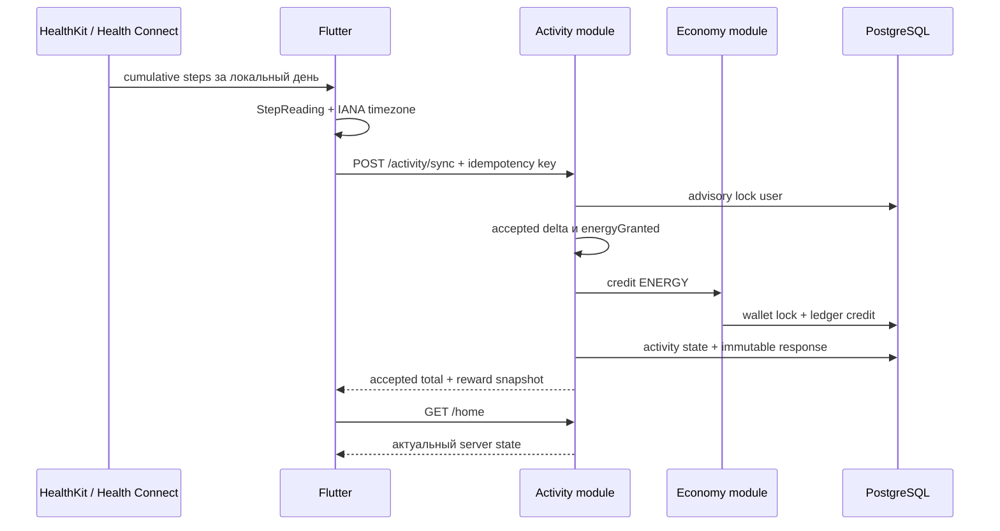
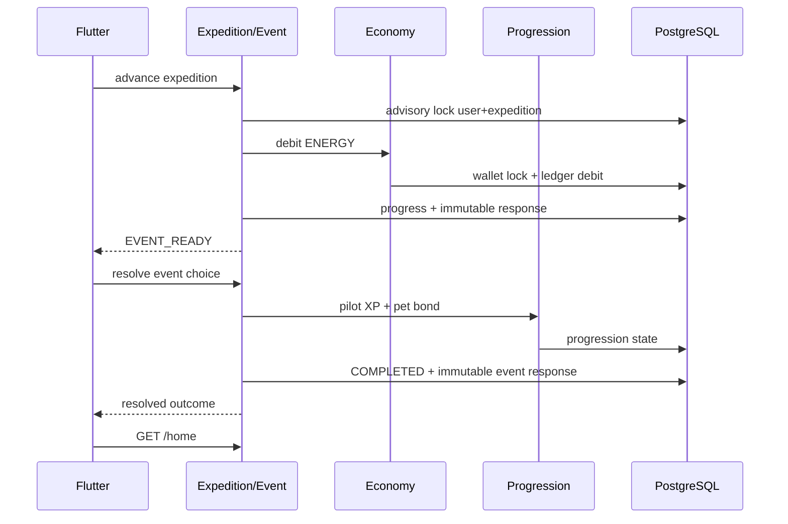

# Архитектура Walking RPG

## 1. Контекст

Проект разрабатывается командой из двух участников. Главный приоритет — получать проверяемые вертикальные срезы без инфраструктуры, которую пока некому обслуживать.

## 2. Базовые решения

- монорепозиторий;
- Flutter mobile;
- Java 21 / Spring Boot backend;
- модульный монолит;
- REST/JSON;
- PostgreSQL + Flyway;
- server-authoritative экономика;
- platform adapters за доменными интерфейсами;
- Redis, очередь и отдельные сервисы только по измеренной необходимости.

## 3. Backend-модули

```text
identity       — технические пользователи и устройства
activity       — приём cumulative activity и high-watermark
economy        — wallet, ledger, credit/debit
expedition     — progress, узлы, события и команды прохождения
progression    — pilot XP, pet bond, уровни
home           — агрегированный read-model главного экрана
content        — server-owned starter content; CMS позднее
social         — отряды и недельные цели; позднее
risk           — антифрод-сигналы; позднее
shared         — только действительно общие примитивы
```

Пакеты группируются по функциональности, а не в один глобальный `controller/service/repository`.

## 4. Mobile-модули

```text
core/config       — compile-time environment
activity/domain   — StepSource, StepReading, sync result
activity/data     — HealthKit/Health Connect adapters и REST client
activity/application — retry/idempotency coordinator
activity/presentation — sync action shell
home              — server-authoritative read-model
expedition        — ENERGY spend command
event             — event resolution command
```

Android- и iOS-host проекты versioned в репозитории.

## 5. Сквозной поток активности



Mobile не отправляет сырые health samples и не вычисляет награду.

## 6. Игровой поток first playable



## 7. Ключевые инварианты

1. Клиент не задаёт accepted delta, награду или новый баланс.
2. Один activity idempotency key не создаёт две награды.
3. Один expedition key не создаёт два списания.
4. Один event key не выдаёт награду дважды.
5. Повтор key с другим business payload возвращает конфликт.
6. Баланс меняется только через `economy_ledger`.
7. `economy_wallet` — транзакционная проекция текущего баланса.
8. Wallet не может стать отрицательным.
9. Несколько устройств используют один daily activity high-watermark пользователя.
10. Понижение platform total не создаёт отрицательную награду.
11. Activity, expedition и event command responses сохраняются как immutable snapshots.
12. Каждая команда публикует все связанные изменения одним transaction commit либо полностью откатывается.
13. Один economy source создаёт не более одной ledger-записи.
14. `GET /home` read-only и не создаёт zero-state в БД.
15. Health adapter не протекает в mobile domain или backend contract.

## 8. Текущая схема данных

```text
app_user
app_device
activity_sync_state
processed_activity_sync
economy_wallet
economy_ledger
expedition_progress
processed_expedition_advance
pilot_progress
pet_progress
processed_event_resolution
```

`processed_*` таблицы содержат fingerprint и исходный response snapshot. Повтор команды после server restart не меняет состояние второй раз и не подменяет ответ более новым балансом/progression.

## 9. Конкурентность

### Activity

- transaction-scoped advisory lock по user;
- общий daily high-watermark;
- wallet row lock;
- commit activity state, credit и response.

### Expedition/Event

- transaction-scoped advisory lock по user + expedition;
- idempotency до изменения состояния;
- wallet/progression row locks;
- commit debit/progress/reward/response.

Подход работает на нескольких экземплярах модульного монолита без Redis-lock.

## 10. Platform Health boundary

```text
StepSource
  ├── PlatformHealthStepSource
  │     ├── HealthGateway
  │     ├── ActivityRecognitionGateway
  │     └── DeviceTimeZoneProvider
  └── DevelopmentStepSource
```

Решения:

- только foreground/manual sync;
- только `STEPS` READ;
- local midnight → now;
- IANA timezone передаётся backend;
- demo source включается только явным flag;
- `includeManualEntries=false` — best effort, не security boundary;
- Android/iOS build проверяются CI;
- физические устройства проверяются отдельной матрицей.

Подробности: [HEALTH_API_SPIKE.md](HEALTH_API_SPIKE.md) и [ADR 0011](adr/0011-platform-health-step-source.md).

## 11. Контент

`starter-v1` пока server-owned code content:

```text
expeditionId: starter-expedition-v1
nodeId:       outer-beacon
threshold:    30 ENERGY
eventId:      signal-source-v1
choices:      analyze-signal / trust-spark
```

Имена, тексты и reward definitions отделены от mutable state. Перед второй главой content definition будет вынесен в версионируемое хранилище или CMS.

## 12. Наблюдаемость до beta

- структурированные логи;
- trace/correlation ID;
- latency/error metrics;
- activity duplicate и total-decreased metrics;
- Health source/permission metrics без health values;
- economy credit/debit metrics;
- wallet-versus-ledger reconciliation;
- expedition/event conflict metrics;
- mobile crash reporting.

## 13. Границы текущей реализации

Не реализованы authentication, attestation, retention processed commands, persistent mobile command queue, background Health delivery, source metadata, полноценный risk score, несколько экспедиций, предметы, навыки и CMS.
