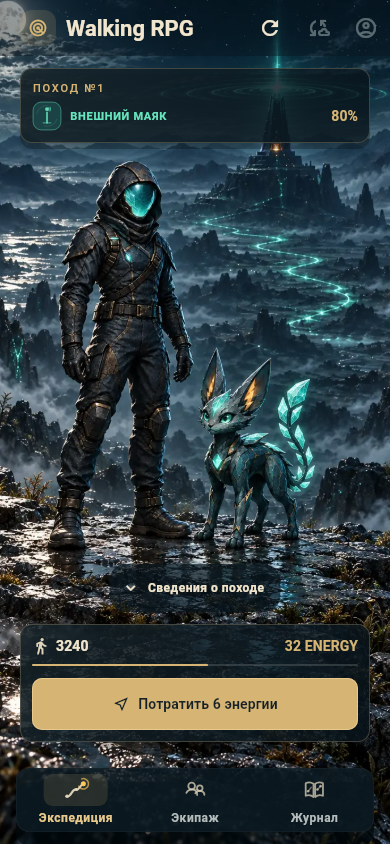

# Full-screen Home visual review

Actual Flutter widget captures for PR #576, rendered from commit
`2425d7382244f16a09434737c1f8067bc2e83915` with Flutter 3.44.7.
Fixtures contain synthetic steps, ENERGY and route progress, SDK Roboto/Material
fonts, and no real account data.

| Preview | Locale / theme | Logical viewport | Text scale |
| --- | --- | --- | --- |
| [Pilot + Spark](home-dark-spark-ru.png) | RU / dark | 390 × 844 | 1.0 |
| [Pilot + Moss](home-light-moss-ru.png) | RU / light | 390 × 844 | 1.0 |
| [Pilot + Navigator](home-dark-rune-en.png) | EN / dark | 390 × 844 | 1.0 |
| [Compact phone](home-narrow-large-ru.png) | RU / dark | 320 × 640 | 1.6 |
| [Enlarged text](home-large-text-en.png) | EN / light | 500 × 800 | 2.0 |
| [Safe-area insets](home-safe-insets-ru.png) | RU / dark; top 44, bottom 34 | 390 × 844 | 1.0 |
| [Reduced motion](home-reduced-motion-ru.png) | RU / dark | 390 × 844 | 1.0 |

The detailed frontier now fills the entire screen, including the toolbar and
navigation. Portrait crew compositions place the pilot and accepted companion
between a compact route HUD and a smoked-glass action panel. Brass outlines,
cream labels and an amber primary action match the environment. The compact
step counter keeps enlarged text from consuming a second row.

The layout measures both HUD groups before fitting the crew. Captures check
edge-to-edge background coverage, toolbar and navigation clearance, all actor
bounds, and the detail-scroll affordance. They also open details and verify
that their scroll viewport stays between the HUD groups. Foreground scenery
blends into the empty frontier when a short screen requires a smaller cast.

The source passed Flutter analysis, all 683 mobile tests and seven explicit
capture cases. Coverage includes exact accepted IDs, neutral fallbacks,
authoritative command guards and impression visibility. Event images keep
independent accessibility descriptions in the clipped detail viewport.
Reduced-motion and ordinary still-scene captures are byte-identical.

Reproduce with the command in [the design system](../../DESIGN_SYSTEM.md#home-crew-scene).
Artwork references and full prompts are in [the asset directory](../../../mobile/assets/scenes/README.md).

These are synthetic widget renders for design review. Physical-device and
owner acceptance remain under TASK-011 / issue #156. Character animation needs
a separate detailed asset pass.
